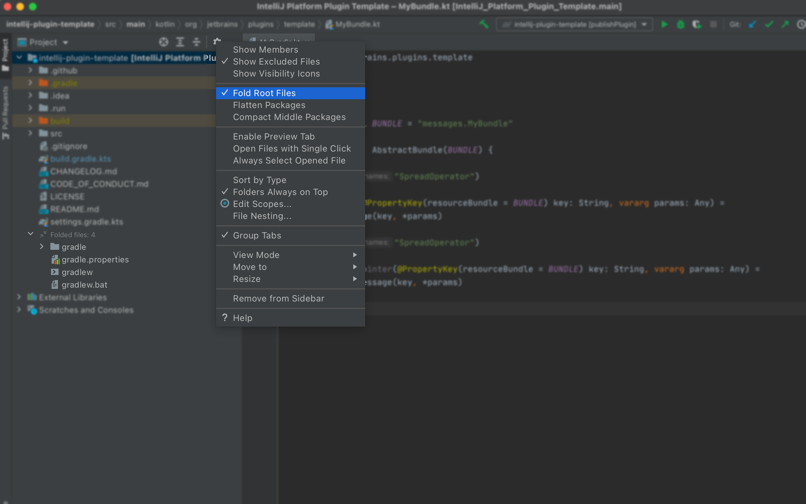
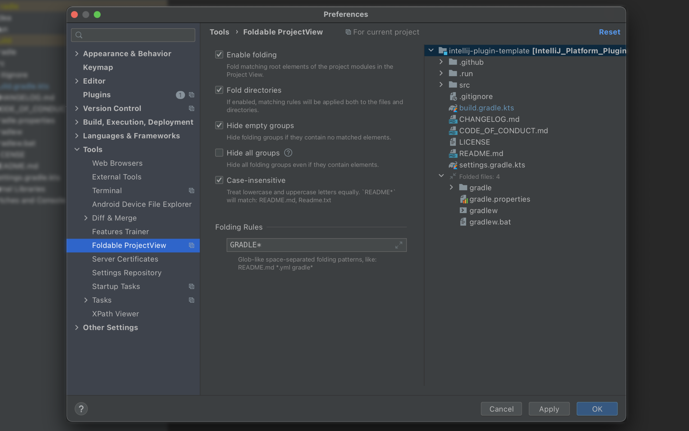

# Foldable Project View

<!-- Plugin description -->

The Foldable Project View is a plugin for the IntelliJ-based IDEs that lets you fold files located in the root of your
project.

Available features:

- Fold matching root elements of the project modules in the Project View
- Enable/disable folding via Preferences or Project View options menu
- Optionally fold directories
- Hide empty groups
- Hide all groups
- Case-insensitive matching
- Live ProjectView preview

## Demo

<!-- Plugin description end -->

## Screenshots

### Project View

### Preferences

## Installation

- Using IDE built-in plugin system:

  <kbd>Settings/Preferences</kbd> > <kbd>Plugins</kbd> > <kbd>Marketplace</kbd> > <kbd>Search for "Foldable Project
  View"</kbd> >
  <kbd>Install Plugin</kbd>

- Manually:

  Download the [latest release](https://github.com/pavankjadda/intellij-foldable-projectview/releases/latest) and
  install it manually using
  <kbd>Settings/Preferences</kbd> > <kbd>Plugins</kbd> > <kbd>⚙️</kbd> > <kbd>Install plugin from disk...</kbd>

---
Plugin based on the [IntelliJ Platform Plugin Template][template].

[template]: https://github.com/JetBrains/intellij-platform-plugin-template
